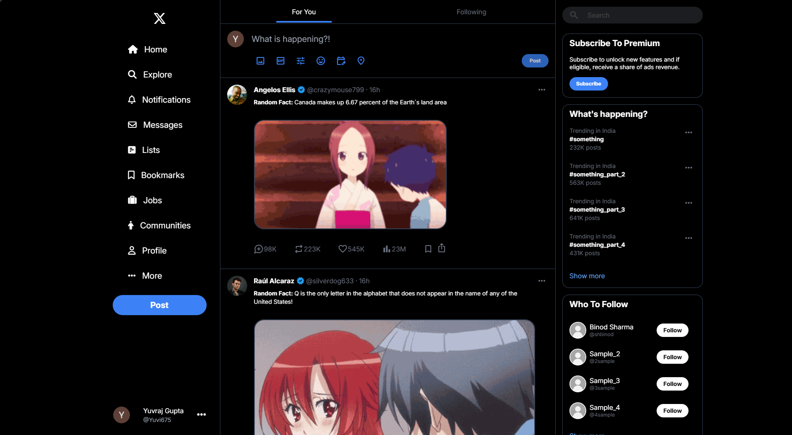

# Twitter Clone

A Twitter (now X) clone built with **Tailwind CSS** featuring infinite scrolling and dynamic content loading via three APIs.

## Features

- Modern UI styled with Tailwind CSS
- Infinite scrolling for seamless feed experience
- Fetches data from three different APIs
- Responsive and mobile-friendly design

## Technologies Used

- [Tailwind CSS](https://tailwindcss.com/)
- JavaScript (or your preferred frontend framework)
- REST APIs

## API Integration

- The app fetches tweets, user data, and media from three separate APIs.
- Infinite scroll loads more content as you reach the bottom of the feed.
- APIs used: [Waifu API](https://www.waifu.im/), [Random User API](https://randomuser.me/) and [Useless Facts API](https://uselessfacts.jsph.pl/).

## Screenshots

